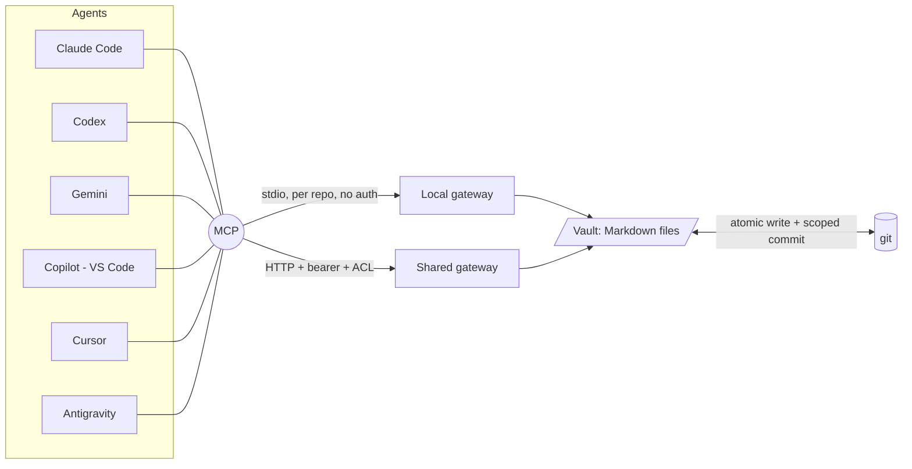
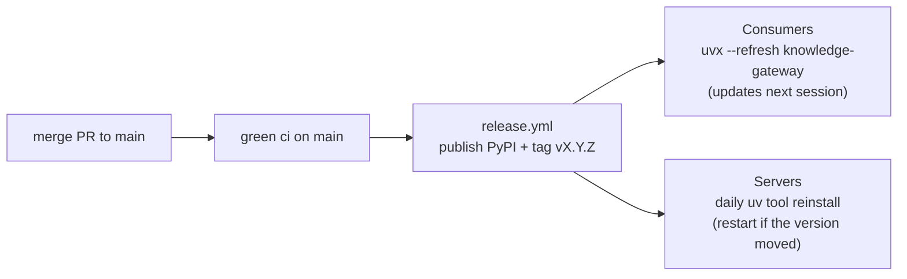

# knowledge-gateway

<!-- mcp-name: io.github.fszalaj/knowledge-gateway -->

A single MCP server that gives agents (Claude Code, Codex, Cursor, Gemini, Copilot, Antigravity)
three capabilities over one connection:

- **Vault** - read, search, and **edit** a git-backed Markdown/Obsidian vault (no Obsidian GUI), git as the source of truth.
- **Code graph** - build and query a knowledge graph of a repo: definitions, imports and calls across ~30 languages (TypeScript/JavaScript, Go, Rust, Java, C#, C/C++, Ruby, PHP, Kotlin, Swift, Terraform/HCL and more) plus Python, and a dedicated Ansible pass for roles, tasks, handlers and `notify` edges. AST-only, local, no LLM.
- **Convert** *(`[convert]`)* - turn PDF / Office / image / HTML files into Markdown.

Install `knowledge-gateway[graph]` - the vault tools and the code graph. `[convert]` is separate
only because its PDF/Office parsers pull a materially larger, native-extension dependency tree.

The vault layer exists because the Obsidian *Local REST API* plugin serves only the one vault open
in a running desktop instance, writes without a lock (silent lost updates), needs a token in every
client, and treats git as secondary. This gateway operates on the files directly, with git as the
system of record - and serves the graph and convert tools over the same connection: one server,
no new servers to wire.

## Architecture



Both modes run the **same** tool implementation over the **same** path guards; they differ in
transport, authentication/ACL, vault loading, and error masking.

## Two ways to run

| | **Local mode** (per repo) | **Shared server** (team) |
|---|---|---|
| Use when | a repo wants its own vault for its agents | many people/vaults behind one always-on endpoint |
| Transport | stdio subprocess (launched by `.mcp.json`) | HTTP (put behind Tailscale/HTTPS) |
| Secrets / tokens | **none** - nothing to generate | per-user bearer tokens (admin-generated) |
| Trust boundary | local filesystem access you already have | tailnet + HTTPS + per-vault ACL |
| Obsidian needed | no | no |

Most repos want **Local mode**. The shared server is only for a central, always-on team gateway.

## Distribution - PyPI ("update once")

The gateway ships as a PyPI package, so a release reaches every consumer and server without
re-pinning anything by hand.



- **Consumers** run `uvx --refresh --from 'knowledge-gateway[graph]' knowledge-gateway` -> the
  latest release is resolved on every launch, so a new release auto-propagates the next time an
  agent starts. No per-repo re-pin.
- **Servers** (long-running) run `uv tool install 'knowledge-gateway[graph,convert]'` plus a
  daily job that reinstalls + restarts only when the published version actually moves.
- Every release is **also** an immutable `vX.Y.Z` git tag - pin `==X.Y.Z` when you need a
  frozen, auditable version.

### Branches

| Ref | What it is |
|---|---|
| `main` | development and the latest release. Every release is cut from a green `ci` here |
| `stable` | the release channel. **Today it is the latest release**, moved by `release.yml` on every publish, so `main` and `stable` name the same commit right after a release |
| `vX.Y.Z` | immutable tag per release, for a frozen or auditable pin |

`stable` is kept as a separate ref on purpose. It costs one step per release now, and it is the
place to slow down later: when releases need soaking before they reach consumers, `stable` stops
tracking every publish and starts lagging `main` by whatever vetting we decide on - without any
consumer having to change a pin. Anything already pinned to `@stable` keeps working through that
change; that is the whole point of the indirection.

PyPI is the recommended channel (`--from 'knowledge-gateway[graph]'`). Use `@stable` only when
you must install straight from git:
`uvx --refresh --from 'knowledge-gateway[graph] @ git+https://github.com/fszalaj/knowledge-gateway@stable' knowledge-gateway`.

## Quickstart - local mode (zero secrets)

Add this to the repo's `.mcp.json` at the repo root:

```jsonc
{
  "mcpServers": {
    "wiki": {
      "command": "uvx",
      "args": ["--refresh", "--from", "knowledge-gateway[graph]",
               "knowledge-gateway", "--local"]
    }
  }
}
```

- `--local` auto-detects the vault in the cwd, in order: the cwd itself if it has `.obsidian/`,
  then `./wiki`, then a single `*-obsidian-vault/`, then a single child dir with `.obsidian/`
  (ambiguous matches error). Pass `--vault ./<dir>` to be explicit.
- `--refresh` re-resolves the latest release each launch, so releases auto-apply (adds ~1-2s to start).
- Commits are scoped to the vault's git subdir and attributed to your own
  `git config user.name/email`. No token: the trust boundary is local filesystem access.

Open the repo in your agent, approve the `wiki` server once, done.

## Tools

| Tool | |
|---|---|
| `list_vaults` | vaults reachable here |
| `list_notes` | Markdown paths in a vault |
| `read_note` | raw note content |
| `list_attachments` / `read_attachment` | list / read binary attachments (image -> inline Image, else File) |
| `list_canvases` / `read_canvas` / `write_canvas` | list / read / write Obsidian Canvas (nodes, groups, colors) |
| `search` | ripgrep literal/regex full-text |
| `backlinks` | notes that `[[wikilink]]` to a note |
| `list_tags` | inline `#tags` with counts |
| `query_notes` | find notes by frontmatter `type` / `tag` (headless Dataview-lite) |
| `write_note` | atomic write (+ optional commit) |
| `patch_note` | insert after a heading or at top/bottom, no full rewrite (+ commit) |
| `patch_frontmatter` | update YAML frontmatter keys, body intact (+ commit) |
| `delete_note` | delete a note (+ optional commit) |
| `rename_note` | rename/move + rewrite inbound flat `[[wikilinks]]` when the name changes (+ optional commit) |
| `git_status` / `git_commit` | pending changes / commit (subdir-scoped, attributed) |
| `list_graphs` / `graph_query` / `graph_neighbors` / `god_nodes` / `graph_shortest_path` / `graph_stats` | query a built code graph |
| `graph_build` | build a code graph from a source tree into `.graph/<name>.json` (local mode only) |
| `convert_to_markdown` | convert a file (PDF/Office/image/HTML/...) in the vault to Markdown (needs `[convert]`) |

Note writes are atomic (temp file + `rename`) and use `safe_note_path`. Attachments, canvases,
conversion inputs and graph files use their own type-specific containment guards. Together they
block traversal, symlink escape and access outside the configured vault.

## Agent skills

The repository includes a validated, provider-neutral Agent Skills pack under `skills/`.
`.agents/skills` and `.claude/skills` point to the same canonical files for native discovery.
Consumer repositories can instead own copies in their documented project-level directory.

The pack covers:

- `gateway-setup` and `gateway-operations` for configuration, verification, operation and release;
- `code-graph-build`, `code-graph-explore` and `code-impact` for architecture discovery and
  blast-radius analysis;
- `wiki-query`, `wiki-curate`, `wiki-ingest`, `wiki-lint`, and `wiki-fold` for durable knowledge;
- `canvas` and `obsidian-markdown` for Obsidian-native authoring;
- `document-convert` for reviewed PDF and Office conversion; and
- `cordis-composability` for reversible effects and declared dependencies.

Skills add repeatable procedures, not privileges. Server-side ACLs, path guards, hooks and CI remain
the enforcement layer. The machine-readable inventory is `skills/manifest.json`; CI validates that
every skill is registered and references only real gateway tools.

Copy selected skills into the destination listed in the sourced compatibility table:

```bash
mkdir -p ../consumer/.agents/skills
cp -R skills/wiki-query skills/wiki-curate ../consumer/.agents/skills/
```

Copy on a branch, do not overwrite an existing same-name skill blindly, and review the consumer
diff. The copied files are then owned and versioned by the consumer repository.

See [`docs/agent-skills.md`](docs/agent-skills.md) for the compatibility matrix, required extras,
workflow harness, maintenance rules and security boundaries.

For the complete pack, run local mode with every capability, conversion included:

```jsonc
{
  "mcpServers": {
    "wiki": {
      "command": "uvx",
      "args": [
        "--refresh",
        "--from",
        "knowledge-gateway[all]",
        "knowledge-gateway",
        "--local"
      ]
    }
  }
}
```

The dependency-free core quickstart above remains the preferred setup when only vault operations
are needed.

## Code graph and conversion

Install profiles. The core vault tools need no third-party parser at all; the code graph ships
in the recommended `[graph]` install, and conversion is separate because its PDF/Office parsers
pull a materially larger, native-extension dependency tree:

| Install | What you get |
|---|---|
| `[graph]` | the code graph and its query tools, over **every supported language**: a tree-sitter pass across ~30 grammars (JS/TS/TSX, Go, Rust, Java, C#, C/C++, Ruby, PHP, bash, PowerShell, Terraform/HCL, Lua, Kotlin, Swift, Scala, R, Perl, Elixir, Clojure, Dart, SQL, Groovy, Julia, Solidity, Haskell, OCaml) plus Python via the stdlib `ast` and a dedicated Ansible pass |
| `[graph-slim]` | the same tools with **only** the two dependency-free extractors, Python and Ansible. Pick this only when the target really is Python/Ansible and the parser pack is not worth its size |
| `[graph-all]` | alias of `[graph]`, kept so older pins keep resolving |
| `[convert]` | attachment -> Markdown via MarkItDown; opt-in PDF and Office parsers add a materially larger dependency tree, including native-extension packages |

**Build a graph** (AST-only - local, no network, no LLM) where the code lives:

```bash
knowledge-gateway-graph /path/to/code-repo -o /path/to/vault/.graph/myrepo.json
# in a local-mode session the graph_build tool does the same, writing .graph/<name>.json
```

Hidden directories (`.git`, `.next`, `.venv`, caches, ...) and common build/vendor output
(`node_modules`, `dist`, `build`, `target`, `vendor`, ...) are always skipped.
`--exclude <name> ...` adds directory names to skip; `--include <name> ...` force-keeps
names the rule would skip (e.g. `.github`, a first-party `vendor/`). Matching is by
directory basename, not path or glob. Same `exclude`/`include` on the `graph_build` tool.

**Query it** over MCP with `graph_query` / `graph_neighbors` / `god_nodes` /
`graph_shortest_path` / `graph_stats`. The graph captures functions, classes, imports and calls
in every supported language.

Ansible gets its own extractor rather than a grammar, because a playbook is YAML: a parser sees
mappings and lists, not structure. That pass reads the *semantics* - roles, tasks, handlers,
`include_role` / `import_tasks` / `notify`, and `task -> filter plugin` edges - so an Ansible
tree becomes a call graph like any other repo. Graph files live in the vault's `.graph/` and are vault-contained
(resolved + checked to stay inside the vault). Query tools are read-only; local `graph_build`
deliberately creates or replaces the selected graph artifact. Vault note tools never depend on it.

## Shared server mode

Run this only for a central, always-on gateway reachable over the network.

**1. Map vaults** - `cp vaults.example.yaml vaults.yaml`, then set `name -> path / repo_root /
subdir`. `repo_root` + `subdir` pathspec-scope commits to a vault that lives inside a larger repo.

**2. Mint a token per user** (the admin does this):

```bash
cp tokens.example.yaml tokens.yaml
openssl rand -hex 32          # once PER user -> the key
chmod 0600 tokens.yaml        # refused at load if group/world-readable
```

```yaml
tokens:
  "8f3c…hex…":
    sub: alice                # identity recorded on that user's commits
    vaults: [teamwiki]        # the ONLY vaults this token may see/touch
    write: true               # false = read-only
```

A token sees only the vaults in its `vaults` list; anything else returns an opaque
`vault_forbidden`. `vaults.yaml` + `tokens.yaml` are gitignored.

**3. Run** - `uv run knowledge-gateway` (127.0.0.1:8765, path `/mcp/`). For a team box, run it as
a service behind Tailscale Serve - see `deploy/` and *Operate* below.

**4. Connect** - the admin shares the token over a password manager (not chat):

```bash
claude mcp add --transport http --scope project teamwiki \
  https://YOUR-HOST.<tailnet>.ts.net/mcp/ --header "Authorization: Bearer $GW_TOKEN"
```

## Security model

- **No secrets in the repo.** `vaults.yaml` / `tokens.yaml` are gitignored; only
  `*.example.yaml` ship. `tokens.yaml` is refused at load if group/world-readable.
- **Local mode has no credential surface** - a local stdio subprocess; the trust boundary is
  filesystem access the user already has.
- **Server mode is defense in depth, not a public endpoint** - tailnet ACL + HTTPS + per-user
  `StaticTokenVerifier` bearer token + per-vault ACL. The bearer layer is a shared secret for
  use **behind a trusted tailnet**; do not expose the server publicly.
- **Path guards on all note I/O** via `safe_note_path` (traversal, symlink, hidden/dotfiles
  incl. `.env`, non-`.md`, `.git`/`.obsidian`). Search/backlinks/tags are bounded to `*.md`.
- **Server-mode error masking** - the HTTP server runs `mask_error_details=True`: only the
  gateway's own expected failures surface as `ToolError`; unexpected OS/git errors are hidden.
  Local mode keeps details visible.
- **Commits are attributed** to the requesting user (server) or the local git identity (local),
  and pathspec-scoped to the vault subdir.

## Set it up with an AI

Paste this into an agent at a repo's root to wire in local mode:

```
Add the knowledge-gateway to this repo so agents can read/edit our vault over MCP with zero
tokens:
1. Create or merge `.mcp.json` at the repo root with an mcpServers."wiki" entry that runs:
   uvx --refresh --from 'knowledge-gateway[graph]' knowledge-gateway --local
   (`--local` auto-detects the vault: ./wiki, a *-obsidian-vault dir, or a dir with .obsidian/.
   If detection is ambiguous, use `--vault ./<vault dir>` instead of `--local`.)
2. Verify: `uvx --refresh --from 'knowledge-gateway[graph]' \
   knowledge-gateway --help` resolves; then in the agent, call list_vaults and read one note.
Branch + PR, no direct push, no AI attribution.
```

For the shared server, ask your gateway admin for a token, then run the `claude mcp add …` from
*Connect* above.

## Operate (servers)

A server runs the latest release as a `uv tool`, with a daily job that reinstalls and
restarts only when the **published version** changes. Reference units are in `deploy/`:

```bash
uv tool install 'knowledge-gateway[graph,convert]'
# the binary lives in the uv cache, so point config at the live files via env:
#   KNOWLEDGE_GATEWAY_VAULTS= <dir>/vaults.yaml   KNOWLEDGE_GATEWAY_TOKENS= <dir>/tokens.yaml
```

- `deploy/knowledge-gateway.service` - the service (systemd `--user`).
- `deploy/knowledge-gateway-update.{service,timer}` + `deploy/auto-update.sh` - the daily auto-update.

Update now instead of waiting for the timer:
`uv tool install --reinstall 'knowledge-gateway[graph,convert]'`, then restart the service. Health: `curl -s -o /dev/null -w '%{http_code}' http://127.0.0.1:8765/mcp/` -> `401`.

## Release (maintainers)

Releasing is a version bump, nothing else. `release.yml` watches for a **green `ci` run on
`main`** whose `pyproject.toml` version has no tag yet, and then does the rest by itself:
build, publish to PyPI (Trusted Publishing, no token), create the `vX.Y.Z` GitHub Release -
which is what creates the tag - and move `stable` onto it.

1. Move `Unreleased` changelog entries into the new version section and bump the version in
   `pyproject.toml` and `server.json`.
2. Run `uv lock` so the lockfile carries the new version, plus the skill validator and the test
   suite. Open a PR; merge only after the Python 3.11-3.13 CI matrix is green.
3. Watch the `release` run. Verify PyPI, the GitHub Release, and that `stable` moved.

The tag is created **last**, so its presence means the release finished. A re-run heals a
half-finished release rather than skipping it: PyPI publishing is `skip-existing`, an existing
GitHub Release is left alone, and `stable` is fast-forwarded to the tag. Pushing a `vX.Y.Z` tag
by hand still works and takes the same path, asserting the tag matches the packaged version.

Consumers pick it up next session; servers within a day (or restart now).

## Develop

```bash
uv venv && uv pip install -e ".[dev]"
uv run pytest                              # ACL + path guards + edit/frontmatter + detect + masking
```
