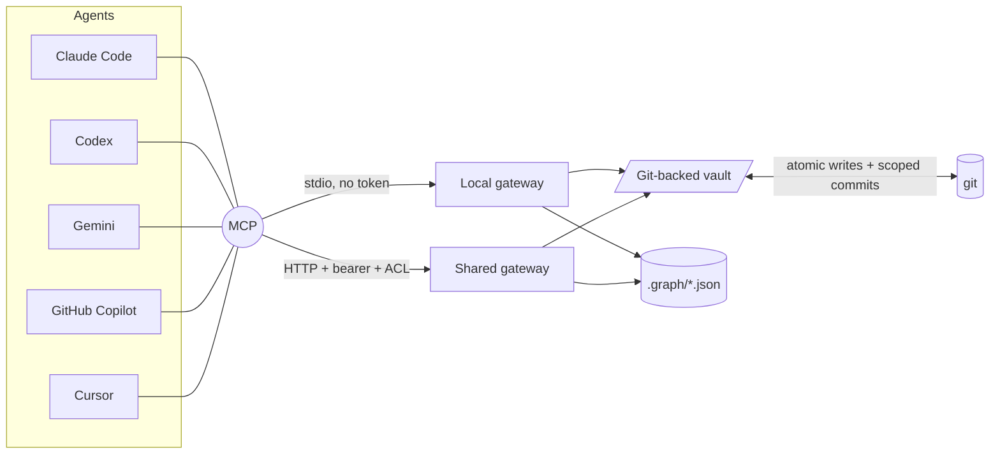
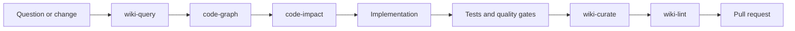

# knowledge-gateway

<!-- mcp-name: io.github.fszalaj/knowledge-gateway -->

A single MCP server that gives Claude Code, Codex, Cursor, Gemini, GitHub Copilot, and other agents a secure interface to:

- **Vaults** - read, search, edit, and commit git-backed Markdown or Obsidian knowledge bases.
- **Code graphs** - build and query deterministic Python, Ansible, and multi-language dependency graphs.
- **Conversion** - turn PDF, Office, image, HTML, CSV, and similar files into Markdown.
- **Agent skills** - run repeatable workflows for code discovery, impact analysis, wiki curation, ingestion, linting, and Canvas authoring.

Obsidian does not need to be running. Git remains the source of truth.

## Architecture



Local and shared modes use the same tool implementation and path guards. They differ in transport, authentication, vault loading, and error masking.

## Run modes

| | Local mode | Shared server |
|---|---|---|
| Best for | one repository and its agents | a team service with many vaults |
| Transport | stdio subprocess | HTTP behind Tailscale/HTTPS |
| Credentials | none | per-user bearer tokens |
| Vault access | local filesystem identity | per-token vault ACL |
| Graph build | allowed | blocked |
| Obsidian required | no | no |

Most repositories should use local mode.

## Quickstart - local mode

Add `.mcp.json` at the consumer repository root:

```jsonc
{
  "mcpServers": {
    "wiki": {
      "command": "uvx",
      "args": [
        "--refresh",
        "--from",
        "git+https://github.com/fszalaj/knowledge-gateway@stable",
        "knowledge-gateway",
        "--local"
      ]
    }
  }
}
```

`--local` auto-detects, in order:

1. the current directory when it contains `.obsidian/`;
2. `./wiki`;
3. a single `*-obsidian-vault/` directory;
4. a single child directory containing `.obsidian/`.

Ambiguous matches fail explicitly. Use `--vault ./path` when detection should not be automatic.

`--refresh` re-fetches the moving `stable` branch at agent startup. Pin an immutable `vX.Y.Z` tag when a fixed, auditable version is required.

## MCP tools

### Vault and Git

| Tool | Purpose |
|---|---|
| `list_vaults` | List vaults available to the current identity. |
| `list_notes`, `read_note` | List and read Markdown pages. |
| `list_attachments`, `read_attachment` | List and read bounded binary attachments. |
| `search` | Ripgrep literal or regular-expression full-text search. |
| `backlinks` | Find pages containing Obsidian `[[wikilinks]]` to a note. |
| `list_tags`, `query_notes` | Inspect tags and frontmatter type/tag metadata. |
| `write_note` | Atomically create or replace a note. |
| `patch_note` | Insert content at top, bottom, or under a heading without full rewrite. |
| `patch_frontmatter` | Update YAML frontmatter while preserving the body. |
| `rename_note` | Rename or move a note and update inbound flat wikilinks. |
| `delete_note` | Delete a note. |
| `git_status`, `git_commit` | Review and commit vault-subdir-scoped changes. |

### Canvas

| Tool | Purpose |
|---|---|
| `list_canvases` | List Obsidian Canvas files. |
| `read_canvas` | Read a JSON Canvas object. |
| `write_canvas` | Atomically write the complete Canvas object. |

### Code graph

| Tool | Purpose |
|---|---|
| `list_graphs` | List graphs under the vault's `.graph/` directory. |
| `graph_build` | Build a graph from a source tree. Local mode only. |
| `graph_stats` | Inspect graph metadata and extraction coverage. |
| `graph_query` | Resolve symbols, modules, roles, tasks, handlers, and resources. |
| `graph_neighbors` | Traverse incoming, outgoing, or bidirectional relations. |
| `god_nodes` | Find highly connected nodes and architectural hotspots. |
| `graph_shortest_path` | Explain how two known nodes connect. |

### Conversion

`convert_to_markdown` converts supported vault files to Markdown when the `[convert]` extra is installed.

## Bundled agent skills

The repository ships nine inspectable, versioned workflow skills:

| Skill | Workflow |
|---|---|
| `code-graph` | Build, refresh, and interrogate a repository graph. |
| `code-impact` | Estimate blast radius and required validation before a change. |
| `wiki-query` | Answer from vault evidence rather than guess. |
| `wiki-curate` | Record durable decisions, modules, procedures, and operational context. |
| `wiki-ingest` | Convert source material into structured, cross-linked knowledge. |
| `wiki-lint` | Check embeds, frontmatter, taxonomy, catalog drift, and pending changes. |
| `wiki-fold` | Compact old operation-log entries without losing history. |
| `canvas` | Create and edit readable Obsidian Canvas maps. |
| `obsidian-markdown` | Author correct wikilinks, embeds, callouts, and frontmatter. |

Canonical files live under `.claude/skills/<name>/SKILL.md`. `.agents/skills` is a symlink to the same package for cross-agent reuse. The procedures use provider-neutral MCP tool names, so Codex, Gemini, Copilot, Cursor, and other clients can copy or reference them from their supported instruction location.

The machine-readable inventory is `.claude/skills/manifest.json`. Validate it with:

```bash
python scripts/validate-skills.py
pytest -q tests/test_skills.py
```

The validator checks frontmatter, naming, manifest coverage, documented tool dependencies, and use of the public gateway tool surface. See [docs/agent-skills.md](docs/agent-skills.md) for the full workflow harness and security model.

### Recommended engineering loop



The skills are operating playbooks. They do not bypass repository tests, review, ACLs, or the gateway's path guards.

## Optional capabilities

The core vault package stays small. Install only the extras required by a deployment:

| Extra | Adds |
|---|---|
| `[graph]` | NetworkX graph plus Python `ast` and Ansible extraction. |
| `[graph-all]` | The above plus tree-sitter extraction for roughly 30 languages, including JS/TS/TSX, Go, Rust, Java, C#, C/C++, Ruby, PHP, shell, PowerShell, Terraform/HCL, Kotlin, Swift, Scala, SQL, and others. |
| `[convert]` | File-to-Markdown conversion through MarkItDown. |
| `[all]` | All optional capabilities. |

A standalone graph can also be built locally:

```bash
knowledge-gateway-graph /path/to/code-repo -o /path/to/vault/.graph/repo.json
```

The graph is deterministic static analysis with no LLM call. It captures definitions, imports, within-file calls, communities, source locations, and Ansible-specific relations such as roles, tasks, handlers, includes, notifications, dependencies, and task-to-filter edges.

Graph evidence is deliberately conservative: it does not prove runtime execution, reflection, dynamic imports, dependency injection, or generated configuration. The bundled skills require source and test verification before conclusions.

## Shared server mode

Copy the examples and map vaults to repositories:

```bash
cp vaults.example.yaml vaults.yaml
cp tokens.example.yaml tokens.yaml
chmod 0600 tokens.yaml
```

Generate a separate token per user:

```bash
openssl rand -hex 32
```

Example token entry:

```yaml
tokens:
  "8f3c...hex...":
    sub: alice
    vaults: [teamwiki]
    write: true
```

Run `uv run knowledge-gateway`. The default HTTP endpoint is `127.0.0.1:8765/mcp/`. Place it behind a trusted tailnet and HTTPS; do not expose it as a public bearer-token service.

## Security model

- Local stdio mode has no token surface; its trust boundary is the user's existing filesystem access.
- Shared mode combines tailnet/HTTPS, a per-user bearer identity, per-vault ACLs, and optional read-only access.
- Every note path is resolved and contained inside the selected vault. Traversal, symlink escape, hidden files, `.git`, `.obsidian`, invalid extensions, and oversized reads are rejected.
- Mutating operations are atomic and serialized by a per-repository lock.
- Git commits are pathspec-scoped to the vault subdirectory and attributed to the requesting identity.
- Shared HTTP mode masks unexpected filesystem and Git errors. Only deliberate client-facing gateway errors are returned.
- Graph files remain contained under `.graph/`. `graph_build` is local-only so a shared service cannot scan arbitrary host paths.
- Optional dependencies are lazily imported; unavailable capabilities fail cleanly without breaking the core vault tools.

## Distribution and operations

Consumers normally track the moving `stable` branch with `uvx --refresh`. Every release is also tagged with immutable `vX.Y.Z`.

Long-running servers can install the `stable` branch as a `uv tool` and use the reference systemd units under `deploy/`:

- `knowledge-gateway.service`
- `knowledge-gateway-update.service`
- `knowledge-gateway-update.timer`
- `auto-update.sh`

A local health request to the protected MCP endpoint should return `401` without a bearer token.

## Development

```bash
uv lock --check
uv venv
uv pip install -e ".[dev]"
uv run python scripts/validate-skills.py
uv run pytest -q --cov=gateway --cov-report=term-missing
```

Repository-wide agent rules are in `AGENTS.md`; GitHub Copilot receives the same boundaries through `.github/copilot-instructions.md`.

## Release

1. Merge a green pull request to `main`.
2. Bump the package version and `CHANGELOG.md`.
3. Tag and push `vX.Y.Z`.
4. Move `stable` to the release with `--force-with-lease`.

Consumers update on their next refreshed session; managed servers update through the deployment timer or an explicit reinstall and restart.
