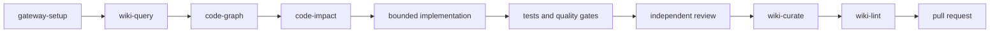

# Agent skills and workflow harness

knowledge-gateway ships reusable skills that turn individual MCP calls into repeatable engineering workflows. Each skill is plain Markdown with YAML frontmatter, so it remains inspectable, versioned, reviewable and portable between agent clients.

## Why skills live in this repository

The gateway defines the trusted tool surface. Keeping the operating playbooks beside the implementation prevents drift between documented tool names, security boundaries and agent behavior. Every skill is registered in `.claude/skills/manifest.json` and validated in the test suite.

The skills are reference assets for agents and consuming repositories; they are not imported into the Python package at runtime and do not add privileges.

## Discovery and portability

The canonical files live under `.claude/skills/<name>/SKILL.md`. The repository also exposes `.agents/skills` as a symlink to the same directory, so one maintained copy works with multiple clients:

- Claude Code: `.claude/skills`;
- GitHub Copilot: `.claude/skills` or `.agents/skills`;
- Codex and open Agent Skills clients: `.agents/skills`;
- other clients: copy or reference the same `SKILL.md` files from their supported instruction location.

On a checkout that cannot materialize Git symlinks, copy `.claude/skills` to `.agents/skills` instead.

## Included workflows

| Skill | Purpose | Required capability |
|---|---|---|
| `gateway-setup` | Configure local/shared access and verify tools | core; `[all]` recommended |
| `code-graph` | Build, refresh and query repository structure | `[graph]` or `[graph-all]` |
| `code-impact` | Estimate blast radius and validation scope | existing graph |
| `knowledge-workflow` | Orchestrate discovery, implementation, review, gates and curation | core; graph recommended |
| `wiki-query` | Restore decisions and project context with evidence | core vault |
| `wiki-curate` | Patch and commit durable engineering knowledge | writable vault |
| `wiki-ingest` | Convert attachments and structure source knowledge | `[convert]` for conversion |
| `wiki-lint` | Audit frontmatter, links, tags, indexes and attachments | core vault |
| `wiki-fold` | Compact old append-only logs without losing history | writable vault |
| `canvas` | Build and update Obsidian Canvas maps | core vault |
| `obsidian-markdown  | Author valid wikilinks, embeds, callouts and frontmatter | core vault |

## Recommended local configuration

Install all optional capabilities when the full skill pack is required:

```jsonc
{
  "mcpServers": {
    "wiki": {
      "command": "uvx",
      "args": [
        "--refresh",
        "--from",
        "knowledge-gateway[all] @ git+https://github.com/fszalaj/knowledge-gateway@stable",
        "knowledge-gateway",
        "--local"
      ]
    }
  }
}
```

Use the dependency-free core command from the root README when only vault operations are needed. Pin an immutable release tag instead of `stable` for regulated or reproducible environments.

## End-to-end engineering loop



The `knowledge-workflow` skill packages this loop as a completion contract:

- restore prior context before planning;
- use graph evidence to scope structural impact;
- write explicit acceptance, security, compatibility and rollback criteria;
- keep implementation and final review in separate contexts;
- require deterministic tests, lint, type, build and deployment verification;
- record durable decisions and operating knowledge after the change.

## Skills, agents, hooks and gates

Use each layer for a different purpose:

- **MCP tools** provide capabilities and controlled access to data.
- **Skills** provide just-in-time procedures and output contracts.
- **Specialist agents/subagents** isolate planning, implementation, security, review or documentation contexts.
- **Hooks and CI gates** enforce deterministic rules such as secret protection, branch policy, formatting, tests and deployed-revision verification.

A skill is guidance, not enforcement. Load-bearing constraints belong in code, hooks, CI and server-side authorization.

## Security boundaries preserved by the skills

- `graph_build` is invoked only in local stdio mode. A shared server cannot scan arbitrary host paths.
- Graph evidence is partial static analysis, never proof of runtime behavior.
- Vault reads and writes retain gateway path containment and ACL checks.
- Curation prefers bounded patch operations over whole-file rewrites.
- Commits are reviewed with `git_status` and remain vault-subdir scoped.
- No skill asks an agent to expose a bearer token, bypass an ACL, follow a symlink outside a vault or weaken error masking.

## Maintaining the package

When adding or changing a skill:

1. Use a lowercase hyphenated directory name.
2. Add `SKILL.md` with frontmatter keys `name` and `description`.
3. Make frontmatter `name` equal the directory name.
4. List every required gateway tool in `manifest.json`.
5. Use only tool names in the validator allowlist, which mirrors the public tool surface.
6. Update `.claude/skills/README.md`, the root `README.md` and `CHANGELOG.md` when the public inventory changes.
7. Run:

```bash
python scripts/validate-skills.py
pytest -q tests/test_skills.py
```
