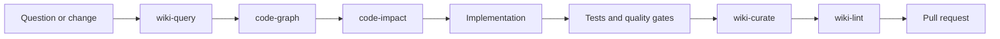

# Agent skills and workflow harness

knowledge-gateway ships reusable skills that turn individual MCP calls into repeatable engineering workflows. The skills are intentionally plain Markdown with YAML frontmatter so they remain inspectable, versioned, reviewable, and portable between agent clients.

## Why skills live in this repository

The gateway defines the trusted tool surface. Keeping the operating playbooks beside that implementation prevents drift between documented tool names, security boundaries, and agent behavior. Every skill is validated against `.claude/skills/manifest.json` in the test suite.

The files are reference assets for agents and consuming repositories; they are not imported into the Python package at runtime.

## Discovery and portability

Claude Code discovers the canonical files under `.claude/skills/<name>/SKILL.md`. Codex, Gemini, GitHub Copilot, Cursor, and other clients can reuse the same content by copying it into their supported instruction directory or linking it from repository instructions. The procedures themselves use provider-neutral MCP tool names.

Recommended consumer setup:

1. Configure knowledge-gateway in `.mcp.json` or the client's MCP settings.
2. Copy the required skill directories into the consumer repository, or reference this package from its agent instructions.
3. Install the gateway extras required by the selected workflows:
   - `[graph]` for Python and Ansible graphs;
   - `[graph-all]` for the broad tree-sitter pass;
   - `[convert]` for document-to-Markdown conversion;
   - `[all]` for all optional capabilities.
4. Run `python scripts/validate-skills.py` in this repository after editing a skill.

## End-to-end engineering loop



- `wiki-query` restores prior context and decisions.
- `code-graph` maps structural dependencies and hotspots.
- `code-impact` turns that graph into a scoped change and validation plan.
- Implementation remains governed by repository tests and security rules.
- `wiki-curate` captures durable decisions and operating knowledge.
- `wiki-lint` checks the knowledge change before merge.

## Security boundaries preserved by the skills

- `graph_build` is invoked only in local stdio mode. A shared server cannot scan arbitrary host paths.
- Graph evidence is treated as partial static analysis, never proof of runtime behavior.
- Vault reads and writes use gateway path containment and ACLs.
- The curation skills prefer bounded patch operations over whole-file rewrites.
- Commits are reviewed with `git_status` and remain vault-subdir scoped.
- No skill asks an agent to expose a bearer token, bypass an ACL, follow a symlink outside a vault, or weaken error masking.

## Maintaining the package

When adding or changing a skill:

1. Use a lowercase hyphenated directory name.
2. Add `SKILL.md` with frontmatter keys `name` and `description`.
3. Make frontmatter `name` equal the directory name.
4. List every gateway tool required by the workflow in `manifest.json`.
5. Use only tool names in the validator's allowlist, which mirrors the public tool surface.
6. Update `.claude/skills/README.md`, the root `README.md`, and `CHANGELOG.md` when the public inventory changes.
7. Run:

```bash
python scripts/validate-skills.py
pytest -q tests/test_skills.py
```
