# Agent skills and workflow harness

knowledge-gateway ships reusable skills that turn individual MCP calls into repeatable engineering workflows. Each skill is plain Markdown with YAML frontmatter, so it remains inspectable, versioned, reviewable and portable between agent clients.

## Why skills live in this repository

The gateway defines the trusted tool surface. Keeping the operating playbooks beside the implementation prevents drift between documented tool names, security boundaries and agent behavior. Every skill is registered in `skills/manifest.json` and validated in the test suite.

The skills are reference assets for agents and consuming repositories; they are not imported into the Python package at runtime and do not add privileges.

## Discovery and portability

The canonical files live under `skills/<name>/SKILL.md`. This repository exposes both `.agents/skills` and `.claude/skills` as relative symlinks to that directory. Consumer repositories can copy the required directories into a documented project-level discovery path.

Paths were verified against the linked official documentation on 2026-08-17; no minimum client version is asserted. Re-check the source after a client upgrade.

| Client | Project-level discovery path | Official source |
|---|---|---|
| Codex | `.agents/skills` | [OpenAI — Build skills](https://developers.openai.com/plugins/build/skills) |
| Gemini CLI | `.agents/skills` or `.gemini/skills` | [Gemini CLI — Managing Agent Skills](https://github.com/google-gemini/gemini-cli/blob/main/docs/cli/using-agent-skills.md) |
| Claude Code | `.claude/skills` | [Claude Code — Extend Claude with skills](https://code.claude.com/docs/en/skills) |
| GitHub Copilot | `.agents/skills`, `.github/skills`, or `.claude/skills` | [GitHub Docs — About agent skills](https://docs.github.com/en/copilot/concepts/agents/about-agent-skills) |
| Cursor | `.agents/skills` or `.cursor/skills` | [Cursor Docs — Agent Skills](https://cursor.com/docs/skills#skill-directories) |

Before copying the full pack, preflight every target and then copy each directory without a trailing slash so BSD/macOS and GNU `cp` preserve the skill directory:

```bash
skill_dest=../consumer/.agents/skills
mkdir -p "$skill_dest"
for skill_dir in skills/*/; do
  skill_name=$(basename "$skill_dir")
  if [ -e "$skill_dest/$skill_name" ] || [ -L "$skill_dest/$skill_name" ]; then
    echo "refusing to overwrite $skill_name" >&2
    exit 1
  fi
done
for skill_dir in skills/*/; do
  cp -R "${skill_dir%/}" "$skill_dest/"
done
```

For a subset, name only the required directories:

```bash
cp -R skills/wiki-query skills/wiki-curate ../consumer/.agents/skills/
```

Use the destination from the compatibility table. Copy on a branch and review the consumer diff before merge. Copies are consumer-owned and versioned; update or remove them through that repository's normal review workflow. This avoids a live dependency on the location of the knowledge-gateway checkout. `manifest.json` remains the source package inventory and is not required for client discovery.

After copying or changing an alias, reload or restart the client and confirm that one copied skill is listed or directly invokable. If it is absent, verify the path against the current linked documentation before proceeding.

If a checkout cannot materialize Git symlinks, copy the skill directories into the native client path instead of treating the alias placeholder as a usable pack.

## Included workflows

| Skill | Use when | Required capability |
|---|---|---|
| `gateway-setup` | Configure local/shared access and verify tools | core; `[all]` recommended |
| `gateway-operations` | Operate shared servers and publish verified releases | deployment access |
| `code-graph-build` | Build, refresh and validate repository structure | `[graph]` or `[graph-all]` |
| `code-graph-explore` | Query graph nodes, relations, hotspots and paths | existing graph |
| `code-impact` | Estimate blast radius and validation scope | existing graph |
| `wiki-query` | Restore decisions and project context with evidence | core vault |
| `wiki-curate` | Patch and commit durable engineering knowledge | writable vault |
| `wiki-ingest` | Convert attachments and structure source knowledge | `[convert]` for conversion |
| `wiki-lint` | Audit frontmatter, links, tags, indexes and attachments | core vault |
| `wiki-fold` | Compact old append-only logs without losing history | writable vault |
| `canvas` | Build and update Obsidian Canvas maps | core vault |
| `obsidian-markdown` | Author valid wikilinks, embeds, callouts and frontmatter | core vault |
| `document-convert` | Convert vault-contained documents and review fidelity | `[convert]` |
| `cordis-composability` | Review reversible effects and declared dependencies | public source material |

## Recommended local configuration

Install all optional capabilities when the full skill pack is required:

```jsonc
{
  "mcpServers": {
    "wiki": {
      "command": "uvx",
      "args": [
        "--refresh",
        "--from",
        "knowledge-gateway[all] @ git+https://github.com/fszalaj/knowledge-gateway@stable",
        "knowledge-gateway",
        "--local"
      ]
    }
  }
}
```

Use the dependency-free core command from the root README when only vault operations are needed. Pin an immutable release tag instead of `stable` for regulated or reproducible environments.

## End-to-end engineering loop

```mermaid
flowchart LR
    S[gateway-setup] --> WQ[wiki-query]
    WQ --> CGB[code-graph-build]
    CGB --> CGE[code-graph-explore]
    CGE --> CI[code-impact]
    CI --> I[bounded implementation]
    I --> V[tests and quality gates]
    V --> R[independent review]
    R --> WC[wiki-curate]
    WC --> WL[wiki-lint]
    WL --> PR[pull request]
```



Use this documented loop as a completion contract:

- restore prior context before planning;
- use graph evidence to scope structural impact;
- write explicit acceptance, security, compatibility and rollback criteria;
- keep implementation and final review in separate contexts;
- require deterministic tests, lint, type, build and deployment verification;
- record durable decisions and operating knowledge after the change.

## Skills, agents, hooks and gates

Use each layer for a different purpose:

- **MCP tools** provide capabilities and controlled access to data.
- **Skills** provide just-in-time procedures and output contracts.
- **Specialist agents/subagents** isolate planning, implementation, security, review or documentation contexts.
- **Hooks and CI gates** enforce deterministic rules such as secret protection, branch policy, formatting, tests and deployed-revision verification.

A skill is guidance, not enforcement. Load-bearing constraints belong in code, hooks, CI and server-side authorization.

The canonical pack deliberately limits frontmatter to the portable common denominator, `name` and `description`. Add client-specific metadata only in a consumer-owned copy and validate it against that client's current documentation.

## Security boundaries preserved by the skills

- `graph_build` is invoked only in local stdio mode. A shared server cannot scan arbitrary host paths.
- Graph evidence is partial static analysis, never proof of runtime behavior.
- Vault reads and writes retain gateway path containment and ACL checks.
- Curation prefers bounded patch operations over whole-file rewrites.
- Commits are reviewed with `git_status` and remain vault-subdir scoped.
- No skill asks an agent to expose a bearer token, bypass an ACL, follow a symlink outside a vault or weaken error masking.

## Maintaining the package

When adding or changing a skill:

1. Use a lowercase hyphenated directory name.
2. Add `SKILL.md` with frontmatter keys `name` and `description`.
3. Make frontmatter `name` equal the directory name.
4. List every required gateway tool in `manifest.json`.
5. Use only tool names in the validator allowlist, which mirrors the public tool surface.
6. Update `skills/README.md`, the root `README.md` and `CHANGELOG.md` when the public inventory changes.
7. Run:

```bash
python scripts/validate-skills.py
pytest -q tests/test_skills.py
```
